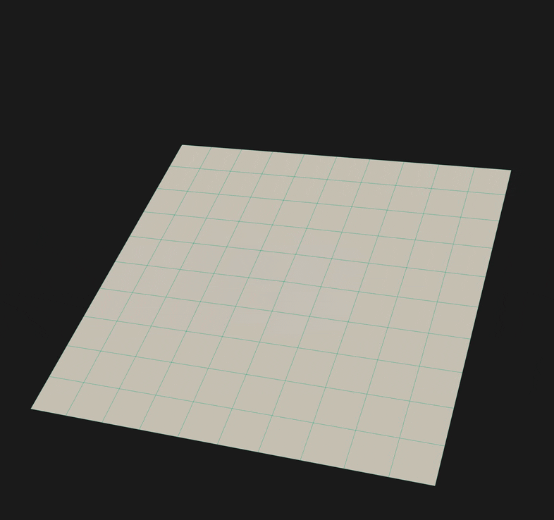
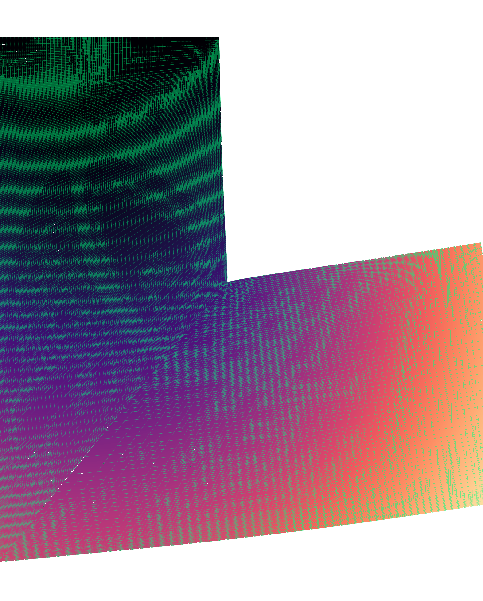
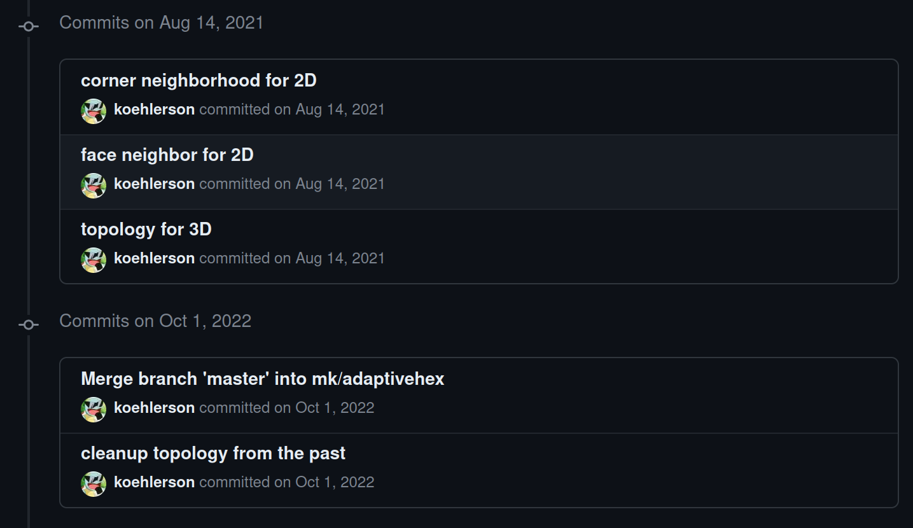
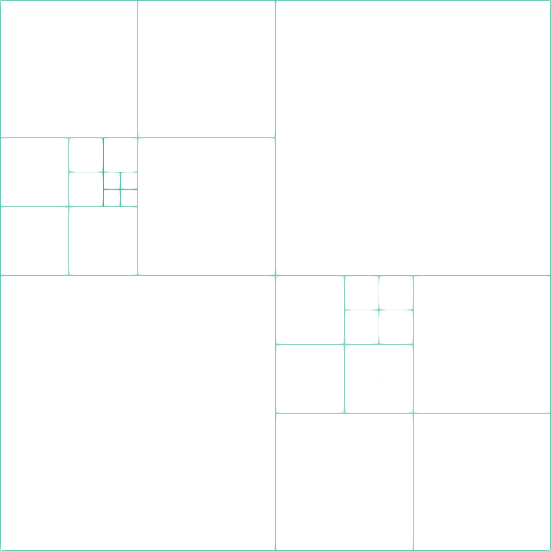
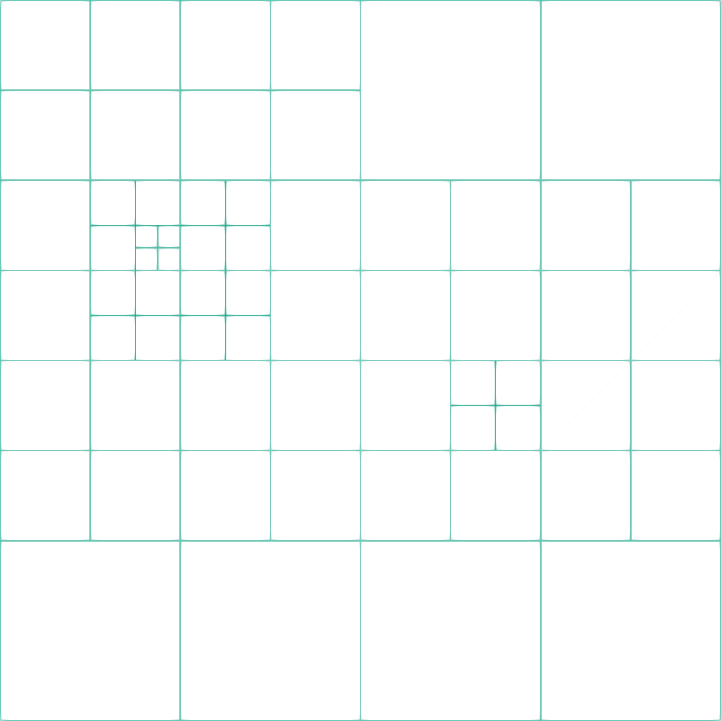

<!--
_class: lead invert
_paginate: false
-->


# **P4est Datastructures for Ferrite.jl**

<div class="grid grid-cols-2 gap-1">

<div>



</div>
<div>



</div>

</div>

---

# **A Short History of Frustration**





___

# **What is P4est?**
- a library/concept that describes a forest with linear octrees
- each octree introduces a new octree coordinate system with an **a priori fixed size** $2^b$, where $b$ is the maximum level
<div class="grid grid-cols-2 gap-2" style="padding-left:100px;padding-right:100px;margin-top:0px">

<div>

```
+--+--+-----+
|  |  |     |
+--+--+     |
|  |  |     |
+--+--+-----+
|     |     |
|     |     |
|     |     |
+-----+-----+
```
</div>
<div>

```
         --■--
     ---/-/ \-\---
  --/   /     \   \--
 ■     ■      /■\    ■
             /| |\
           /- / \ -\
          /  |   |  \
         /   |   |   \
        ■    ■   ■    ■

```
</div>

</div>

---

# **Octant and Octree**

<div class="grid grid-cols-2 gap-20">

<div>

```julia
struct OctantBWG{dim, N, M, T} <: AbstractCell{dim,N,M}
    #Refinement level
    l::T
    #x,y,z \in {0,...,2^b} where (0 ≤ l ≤ b)}
    xyz::NTuple{dim,T}
end
```

Leave array realized as `Vector`, storing physical corner nodes of root octant in `nodes`
```julia
struct OctreeBWG{dim,N,M,T} <: AbstractAdaptiveCell{RefHypercube{dim}}
    leaves::Vector{OctantBWG{dim,N,M,T}}
    #maximum refinement level
    b::T
    nodes::NTuple{N,Int}
end
```

</div>
<div>

```
   +--------+
  /        /|
 /        / |
+--------+  |
|        |  |
|        |  +
|        | /
|xyz     |/
⊗--------+
```

</div>

</div>

---

# **Leave Index vs. Morton Id**

<div class="grid grid-cols-2 gap-20">

<div>

```
x-----------x-----------x
|           |           |
|           |           |
|     9     |    10     |
|           |           |
|           |           |
x-----x--x--x-----------x
|     |6 |7 |           |
|  3  x--x--x           |
|     |4 |5 |           |
x-----x--x--x     8     |
|     |     |           |
|  1  |  2  |           |
x-----x-----x-----------x
```

</div>
<div>

```
x-----------x-----------x
|           |           |
|           |           |
|     33    |    49     |
|           |           |
|           |           |
x-----x--x--x-----------x
|     |15|16|           |
|  9  x--x--x           |
|     |13|14|           |
x-----x--x--x     17    |
|     |     |           |
|  1  |  5  |           |
x-----x-----x-----------x
```

</div>

</div>

___

# **Intraoctree Operation `*_neighbor`**

<div class="grid grid-cols-2 gap-0">

<div>

```
x-------x-------x
|       |       |
|   3   |   4   |
|       |       |
x-------x-------x
|       |       |
o   1   *   2   |
|       |       |
x-------x-------x
```
- octant 1 at `xyz=(0,0)`, maximum refinement level of 1 and faceindex 2 (marked as `*`)

</div>
<div>

- face neighbor will be octant 2 with `xyz=(1,0)`
- leaving the octree boundaries possible by e.g. query with face index 1 (marked as `o`), returns octant at `xyz=(-1,0)`.
- same for `edge` and `corner`

</div>

</div>

___

# **Interoctree Operation `transform_*`**

<div class="grid grid-cols-2 gap-0">

<div>

```
x-------x-------x
|       |       |
|  o3   |  o4   |
|       |       |
x-------x-------x
|       |       |
|  o1   *  o2   |
|       |       |
x-------x-------x
```
- 4 octrees with a single leaf each and maximum refinement level of $b=1$

</div>
<div>

- transform octant 1 into coordinate system of octant 2
- Octant of octree 1 at `xyz=(0,0)` from octree 1 coordinate system, in octree 2 coordinate system at `xyz=(-2,0)`
- same for `edge` and `corner`

</div>

</div>

___

# **Collecting Nodes of the Forest**

- Big problem with the lazy forest approach: collecting nodes without duplication

1. Distribute intraoctree unique nodes based on octree index $k$ and octant corner $xyz$
2. Remove interoctree duplication based on vertex, edge and face neighborhood

Two sweeps through the forest.
___

# **Collecting Hanging Nodes of the Forest**

- In order to constraint hanging nodes, we need to detect them and associated "master" nodes

1. Loop over all octrees and octants
2. Loop over all corners
3. If pivot corner center of parent face hanging node candidate
4. Check inter and intraoctree

___

# **Balancing**

enforce 2:1 balance
<div class="grid grid-cols-2 gap-1">

<div>



</div>
<div>



</div>

</div>

___

# **Reconstruct Boundary Facesets**

After adaptation the boundarysets changed, so they need to be updated

1. Loop over all facesets
2. Loop over all faceindices in the faceset
3. Loop over all descendants of the faceindex and detect if any descendant face is contained in root face

___

# **A Story About AbstractGrid Interface 1/2**

```julia
julia> grid = generate_grid(Quadrilateral,(1,1));
julia> adaptive_grid = ForestBWG(grid,3);
julia> dh = DofHandler(adaptive_grid);
julia> add!(dh,:u,Lagrange{RefQuadrilateral,1}());

julia> close!(dh)
ERROR: type OctantBWG has no field nodes
Stacktrace:
 [1] getproperty
   @ ./Base.jl:37 [inlined]
 [2] get_node_ids(c::OctantBWG{2, 4, 4, Int32})
   @ Ferrite ~/repos/Ferrite.jl/src/Grid/grid.jl:119
```

___

# **A Story About AbstractGrid Interface 2/2**

The cell is in this case an octant, which will never know without the tree its vertices.

```julia
function add_vertex_dofs(cell_dofs::Vector{Int}, cell::AbstractCell, vertexdict, nvertexdofs::Vector{Int}, nextdof::Int, n_copies::Int)
    for (vi, vertex) in pairs(vertices(cell))
        ...
    end
end
```

How to handle this? Use special dispatches for the DofHandler?

___

# **Open ToDos**

- finalize elasticity example with Zienkiwicz Zhu error estimator based on L2 Projection
  - L2 Projector seems to dislike the hanging nodes
- reconstruct neighborhood information after adaptation of the grid
- iterator over (half) faces, edges and corners
- Directly iterate over the lazy datastructure instead of materializing to a `Ferrite.Grid` for each solve
